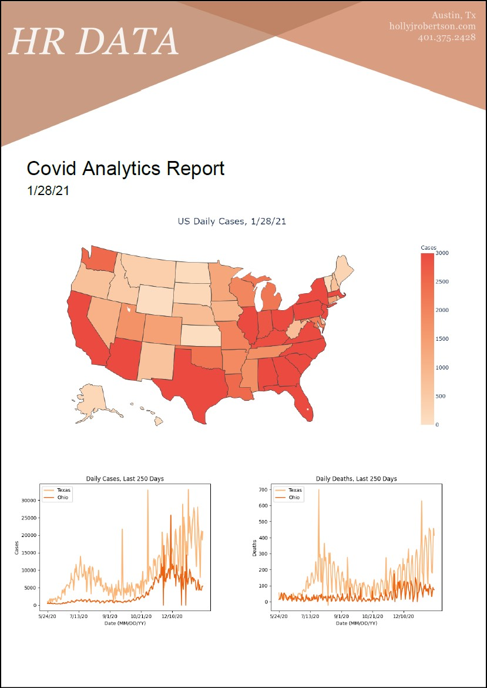

# Generate Analytics Report
A simple Python project that aggregates COVID related data from the CDC.


## Setup
You'll want to download all of this code locally. The easiest way to do that is cloning the repo.
```
$ git clone https://github.com/hollyjrobertson/COVID_AnalyticsReport
```
If you have any trouble doing this, you can download the zip folder of this repo and then extract the files to a local file. Once you have all the files cloned locally, you should make sure you have all the necessary libraries installed.
```
$ pip install fpdf
$ pip install pandas numpy matplotlib
$ pip install plotly
$ pip install -U kaleido
```
If you run into an error with NumPy, changing the version to 1.19.3 fixed the issue for me <br/>(1.19.5 is current version (1/29/21)
```
$ pip install numpy==1.19.3
```
To test if everything is set up properly, run:
```
$ python generate_report.py
```

You should get a fresh report file (yesterday_covid_report.pdf) in the directory of your code. <br/>

To get LIVE data, You'll have to change `helper.py` to read from the online version of the data. <br/> 
Uncomment the BASE_PATH URL and comment the BASE_PATH='./data'.<br/> 
You will also have to comment out the hard coded `yesterday` date at the bottom of `generate_report.py` file. 

